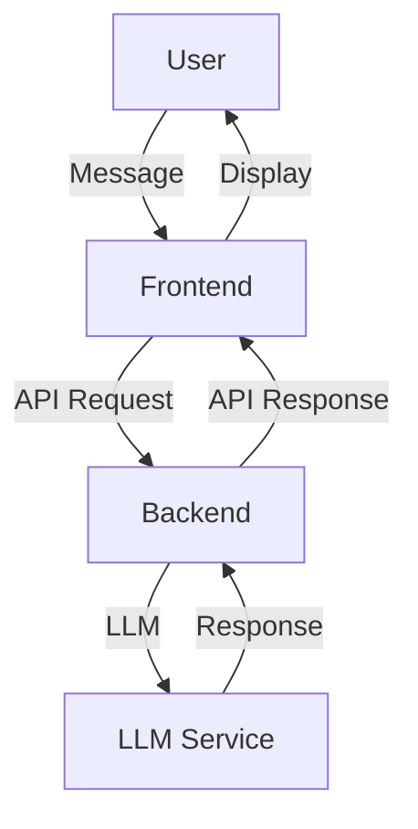

# Sprint 7 Plan: LLM Chat Demo

## Objective

Design and implement a conversational LLM chat demo in the project, allowing users to interact with an AI assistant in a chat interface.

## Goals

- Build a user-friendly chat UI for multi-turn conversations with an LLM.
- Implement a backend API to handle chat messages and return LLM-generated responses (simulated or real).
- Ensure accessibility, responsiveness, and design system consistency.
- Document the architecture, usage, and extension points for the chat demo.

## Tasks

1. **Requirements & Design**
   - Define user stories and acceptance criteria for the chat demo.
   - Design UI wireframes and data flow diagrams.
2. **Frontend Implementation**
   - Create a chat page with message history, input box, and send button.
   - Display user and AI messages in a conversational format.
   - Handle loading and error states.
3. **Backend Integration**
   - Implement an API endpoint to receive chat messages and return LLM responses.
   - For demo, simulate LLM responses; optionally connect to a real LLM API.
4. **Testing & QA**
   - Write unit and integration tests for frontend and backend.
   - Conduct user testing and gather feedback.
5. **Documentation**
   - Update project documentation with setup, usage, and architecture details.
   - Add a walkthrough for the chat demo in the docs.

## User Stories & Acceptance Criteria

- As a user, I want to send messages and receive AI responses in a chat format.
- As a user, I want to see the full conversation history.
- As a user, I want the chat UI to be accessible and easy to use.

## Data Flow Diagram

## Acceptance Criteria

- [ ] Users can send and receive messages in a chat interface.
- [ ] Conversation history is displayed and updated in real time.
- [ ] The UI is accessible and uses design system components.
- [ ] The backend returns simulated or real LLM responses.
- [ ] Documentation and walkthrough are available in the docs folder.

## Deliverables

- Functional LLM chat demo integrated into the project.
- Documentation and usage guide in the docs folder.
- Test cases and user feedback summary.

## Timeline

- **Week 1:** Requirements, design, and backend setup
- **Week 2:** Frontend implementation and LLM integration
- **Week 3:** Testing, documentation, and final review

---

_Sprint 7 focuses on delivering a robust, user-friendly LLM chat demo to enhance the project's AI capabilities._
